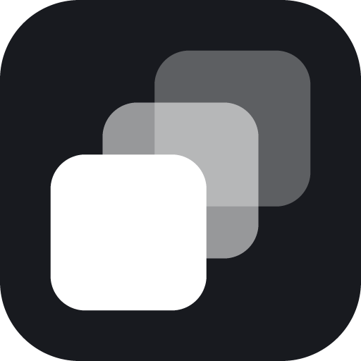

# gifnotjif

Press a hotkey, drag a box over part of your screen, press stop. The GIF lands
on your clipboard, ready to paste into Slack, Discord, or a GitHub comment.

Windows works today. macOS and Linux on X11 have adapters that have not yet been
run on real hardware. Wayland is refused outright. See
[Platforms](#platforms).

## Installing it

Grab an installer from [Releases](https://github.com/horsedonkey-se/gifnotjif/releases):
`.exe` for Windows, `.dmg` for macOS, `.AppImage` for Linux.

They are not code signed, so both Windows and macOS will complain the first time.
Windows: More info, then Run anyway. macOS: right-click the app, Open, Open.
Linux needs `chmod +x` on the AppImage and `xclip` installed for the clipboard
step to work.

## Updating it

Windows and Linux update themselves: a new release downloads in the background
and installs when you quit, or sooner from the tray menu.

macOS only tells you, and links to Releases. Unsigned builds cannot self-install.

Turn it off with `"autoUpdate": false` in `settings.json`.

## Running from source

```
npm install
npm start
```

It lives in the tray. `Ctrl+Shift+G` starts a recording, and again stops it.

```
npm run doctor    # what the app sees: displays, scaling, ffmpeg, platform support
npm run spike     # record a fixed region with no UI, for testing the pipeline
```

The source is TypeScript. Every script above compiles first, into `dist/`, which
mirrors the source tree so `__dirname`-relative paths hold. `npm run build`
compiles on its own and `npm run typecheck` only checks. The renderer scripts are
classic scripts rather than modules, because Chromium will not load a module over
`file://`.

## How it works

```
hotkey
  -> transparent overlay on every display, drag to select
  -> ffmpeg captures the region to a temporary near-lossless mp4
  -> ffmpeg encodes that to a GIF with a palette tuned for screen content
  -> the GIF goes on the clipboard
```

Capture and encode are separate on purpose. Capture stays cheap so it does not
drop frames, and the expensive palette work happens once, after you stop.

## The clipboard, which is the hard part

There is no cross-platform clipboard format for an animated GIF. Hand an app
raw image bytes and it pastes a single still frame. So the file itself goes on
the clipboard and the receiving app treats it as an upload.

On Windows that means `CF_HDROP`, written through
`System.Windows.Forms.Clipboard`, which only works on an **STA** thread. Hence
`powershell.exe -STA` in `src/main/scripts/copy-gif.ps1`. Note that
`Set-Clipboard -Path` does not exist and PowerShell 7 dropped the `-STA` switch,
so this specifically needs Windows PowerShell 5.1.

Three formats go on at once, so whichever one the target app reads, it finds
something: the file drop, the raw GIF bytes, and the path as text. A bitmap is
deliberately **not** offered, because apps that see one tend to prefer it and
paste a still.

macOS does the same through `src/main/scripts/copy-gif.jxa.js`. Linux cannot:
`xclip` and `wl-copy` serve one type each, so `clipboardMimeType` in settings
picks it.

The clipboard holds a path, not the bytes, so **deleting the GIF breaks the
paste**. Recordings live in the app's user data folder and are swept after
`keepForDays` instead. Only the intermediate mp4 goes straight away.

## Settings

`settings.json` in the app's user data folder. Open it from the tray menu.

| key | default | notes |
|---|---|---|
| `hotkey` | `CommandOrControl+Shift+G` | if another app owns it, a fallback is bound instead and the tray says which |
| `discardHotkey` | `Escape` | throws the take away; held only while recording, so it is taken from the app on camera for that time. `""` turns it off |
| `maxDurationSecs` | `300` | a take stops itself here and is encoded as usual. `0` for no limit |
| `minFreeDiskMb` | `500` | refuses to start, and stops a running take, below this much free disk. `0` turns it off |
| `fps` | `12` | |
| `maxWidth` | `800` | GIFs above ~10MB are rejected by GitHub and Discord |
| `colors` | `128` | |
| `dither` | `none` | use `bayer:bayer_scale=5` for gradients or video |
| `drawMouse` | `true` | |
| `keepForDays` | `7` | how long old recordings survive |
| `clipboardMimeType` | `text/uri-list` | Linux only; try `image/gif` if a target app wants bytes |

The size defaults were measured, not guessed. On a busy 800x600 three-second
capture, `fps` 15 to 12, 256 to 128 colours, and dithering off together took the
output from 10.0MB to 6.0MB. Turning dithering off is the interesting one: screen
content is mostly flat UI colour that quantises cleanly, so a dither pattern just
adds noise the compressor has to store. Compared side by side at 2x on real UI,
text was no sharper with it and the flat areas were visibly grainier.

## Two traps worth knowing about

**ffmpeg probes before it encodes.** The default `probesize` is 5MB, measured in
bytes rather than time, so a small region at a low frame rate can spend seconds
filling it. A 300x200 capture at 10fps produces 2.4MB/s and stalls for about two
seconds, and any recording stopped before probing finished produced an empty
file. `-probesize 32 -analyzeduration 0` makes encoding start on the first frame.

**Stop ffmpeg by writing `q` to its stdin**, never a signal. Windows has no POSIX
signals, and killing the process skips the mp4 trailer and leaves a file nothing
can open. The same write works on macOS and Linux, so there is one code path.

## Platforms

Everything platform-specific sits behind `PlatformAdapter` in
`src/main/types.ts`, implemented once per platform in `src/main/platform/`. The
adapters live in one typed map, so `npm run typecheck` checks all three from any
machine. Each adapter answers two support questions separately: whether it can
capture at all, asked before the overlay opens, and whether it can reach the
clipboard, asked after encoding, when the file on disk is still a usable answer.

| | capture | clipboard | bar hidden from capture |
|---|---|---|---|
| Windows | gdigrab | `CF_HDROP` + 2 more | yes, build 19041+ |
| macOS | avfoundation | `NSPasteboardItem`, 3 types | no, unmeasured |
| Linux X11 | x11grab | one MIME type, via `xclip` | no |
| Linux Wayland | refused | `wl-copy` | no |

Known rough edges, all commented where they live:

- macOS device numbers are not display numbers, and the mapping between
  Electron's display order and ffmpeg's is assumed rather than guaranteed.
  `npm run doctor` prints it; check it before trusting a capture.
- Wayland is refused because XWayland makes a broken capture look like a working
  one. Getting it working means `xdg-desktop-portal` and PipeWire.
- macOS and Linux X11 have never been run. `npm run doctor`, then
  `npm run spike`, then a real recording on a second display is the order that
  finds problems fastest.

## Contributing

See [CONTRIBUTING.md](CONTRIBUTING.md). The most useful thing anyone can do
right now is run it on macOS or Linux X11 and report what happens, since neither
adapter has ever touched real hardware.

## License

GPL-3.0-or-later. Copyright (C) 2026 Hargaaya Idris. See [LICENSE](LICENSE).

The license follows the dependency: `ffmpeg-static` ships a GPL-3.0 ffmpeg
binary, which this app runs and any packaged build would bundle.
